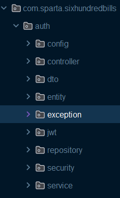
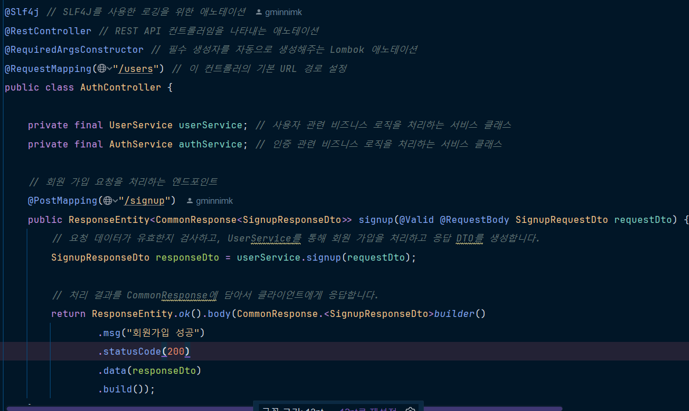
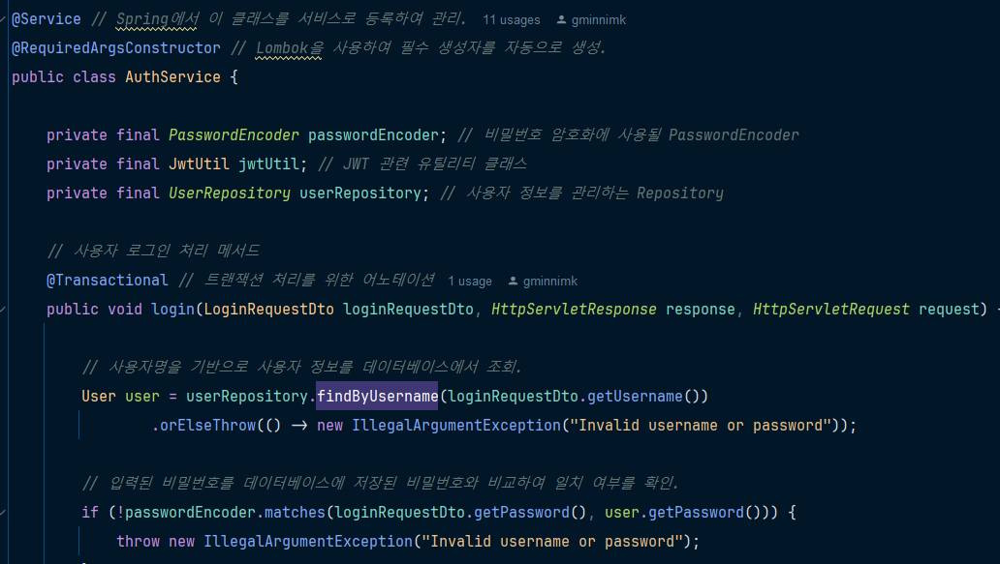
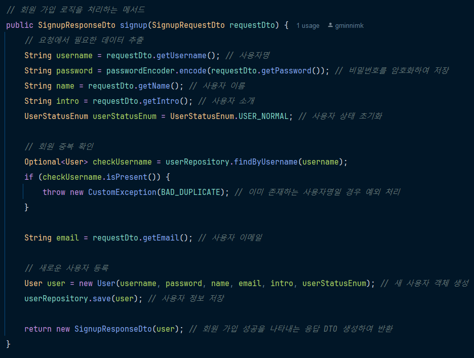
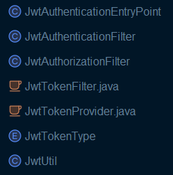
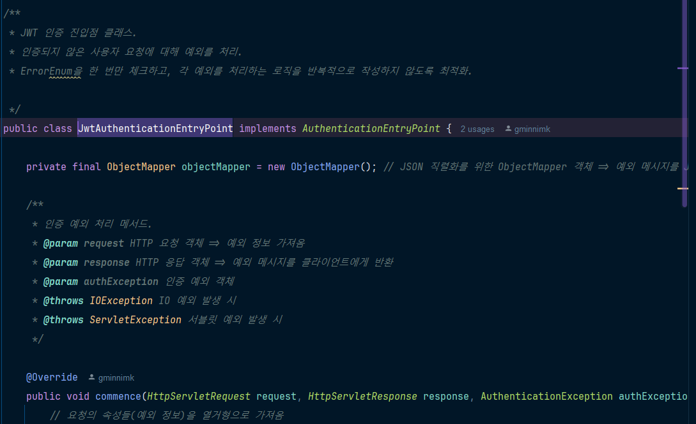
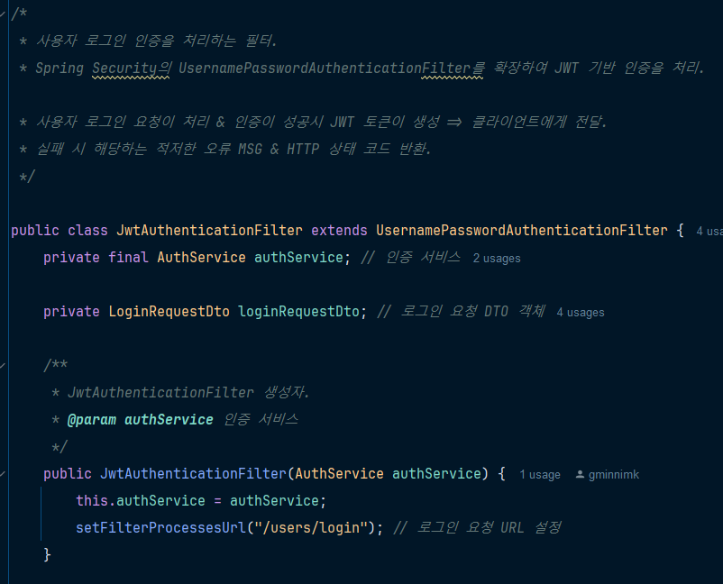

 

## 🔎  제목 : Feat/#2 Make Authentication & Authorization & Auth function 구현

 

## 🔎 작업 내용

- auth 관련 전반적인 기능 및 관련 클래스 구현
  

- 회원가입, 로그인, 로그아웃, 토큰 재발급 기능 UPDATE
  
  
  

  

- JWT 관련 필터 생성

  

  

   ... 

  

 

## 🔎  기타 수정 사항

- 관련 클래스들 추가 생성 (EX : dto, service, security ..)

 

## 🔎   앞으로의 과제

- 적용 테스트

- 필요한 부분 수정 및 추가 구현

- 회원 권한 부여 확인

   

